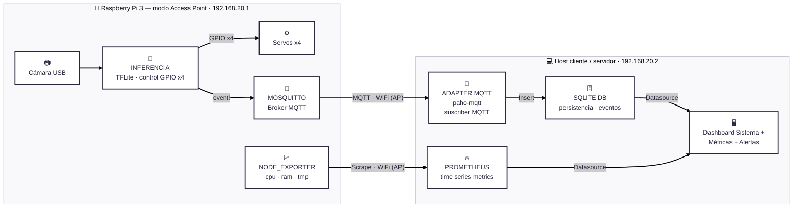

# 2026-g5-ecosort — EcoSort

**Taller de Proyecto II 2026 — Grupo G5**

Clasificador automático de residuos en 4 categorías (plástico, papel, vidrio,
orgánico) basado en visión por computadora sobre Raspberry Pi 3, con un
mecanismo físico de 4 compuertas y un pipeline de datos hacia un dashboard de
monitoreo.

> **Estado del repositorio:** fin de Semana 2 — entrega del Plan de Proyecto y
> primeros prototipos de código. Además de la documentación de arquitectura y
> las ADRs, ya hay pruebas locales de modelos de clasificación
> (`software_detección/TrashNate`) y el circuito de alimentación de hardware
> definido.

---

## Equipo

| Integrante | usuario |
|---|---|
| Francisco Estrada | `festradax07` |
| Micaela Taini | `mikitalinda` |
| David Alvarez | `davidalvarezok` |

Docente/cátedra: seguimiento de decisiones (ver ADRs con estado *Pendiente
confirmar con el docente*).

---

## Visión general del sistema




Versión renderizada: [`docs/arquitectura-mmd.png`](docs/arquitectura-mmd.png).
El diagrama original en drawio queda como referencia histórica en
[`docs/diagramas/`](docs/diagramas/).

### Componentes

- **Producto (dispositivo):** gabinete con cámara, tolva, plataforma fija de
  **4 compuertas** (una por clase, cada una con su servo SG90, las 4 arrancan
  cerradas) y la Raspberry Pi 3 en el interior.
- **Inferencia:** modelo de clasificación de 4 clases exportado a **TFLite
  int8**, obtenido por *fine-tuning* sobre un modelo preentrenado con una
  herramienta drag-and-drop (a confirmar con el docente).
- **Transporte:** **MQTT** con **Mosquitto** como broker corriendo en la
  propia Pi.
- **Persistencia:** **SQLite** (`eventos.db`), poblada por un script
  adaptador (Python + `paho-mqtt`) suscripto al tópico de eventos.
- **Visualización:** **dashboard propio (Front End)**, leyendo el dato de
  negocio desde SQLite y, como segundo datasource, Prometheus para la salud
  del dispositivo — reemplaza a Grafana a pedido del docente (ver
  [ADR 0005](docs/adr/0005-dashboard-propio-reemplaza-grafana.md)).
- **Observabilidad del dispositivo (EXTRA, opcional, fase final):**
  `node_exporter` en la Pi + **Prometheus** en el host externo, como
  datasource del dashboard propio, con reglas de alerting a reimplementar
  (staleness de `eventos`, `up == 0`, temperatura ~80 °C, CPU sostenida alta).

### Red

La Pi arma su propia red en modo Access Point: `192.168.20.0/28` (14 hosts
usables), Pi en `.1`, host cliente/servidor en `.2`. El tráfico MQTT nunca
sale de esta red, por lo que se acepta operar **sin TLS ni autenticación**.

---

## Prototipo de detección — `software_detección/TrashNate`

Primeras pruebas locales de clasificación de imágenes, corriendo sobre el
dataset público [TrashNet](https://github.com/garythung/trashnet)
(`Data/archive/dataset-resized/`, 6 clases: cardboard, glass, metal, paper,
plastic, trash — todavía no mapeadas a las 4 clases finales del producto):

- [`main.py`](software_detección/TrashNate/main.py): entrena una CNN
  (Keras/TensorFlow) con data augmentation y exporta `modelo_trashnet.h5`.
- [`cam_test.py`](software_detección/TrashNate/cam_test.py): prueba el
  modelo entrenado en vivo contra la webcam (OpenCV).

Es un prototipo exploratorio para comparar modelos y condiciones (fondos,
iluminación, disposición del residuo) antes de definir el modelo final —
todavía no exporta a TFLite ni corre sobre la Pi (ver ADR 0001 y pendientes
de Semana 3).

---

## Documentos y entregas

| Documento | Contenido |
|---|---|
| [`docs/Plan de Proyecto-G5.pdf`](<docs/Plan de Proyecto-G5.pdf>) | Plan de Proyecto entregado (requerimientos, objetivos, alcance) |
| [`docs/presentaciones/EcoSort_Presentacion.pdf`](docs/presentaciones/EcoSort_Presentacion.pdf) | PowerPoint de la presentación del proyecto |
| [`docs/circuito-de-alimentacion/Circuito de alimentación.pdf`](<docs/circuito-de-alimentacion/Circuito de alimentación.pdf>) | Circuito de alimentación de Raspberry Pi, servos y demás componentes |
| [`docs/modelo-ideas/varios-prototipos-propuestos.pdf`](docs/modelo-ideas/varios-prototipos-propuestos.pdf) | Prototipos de maqueta evaluados para el gabinete |

---

## Estructura del repositorio

```
.
├── README.md
├── BITACORA.md                              # Bitácora semanal del equipo
├── docs/
│   ├── Plan de Proyecto-G5.pdf              # Entrega del Plan de Proyecto
│   ├── arquitectura-mmd.png                 # Render del diagrama Mermaid
│   ├── arquitectura-software.png            # Diagrama de arquitectura (versión anterior)
│   ├── adr/                                 # Architecture Decision Records
│   │   ├── 0001-modelo-preentrenado-vs-finetune.md
│   │   ├── 0002-plataforma-4-compuertas-collar.md
│   │   ├── 0003-mqtt-sqlite-como-contrato.md
│   │   ├── 0004-grafana-vs-dashboard-propio.md
│   │   └── 0005-dashboard-propio-reemplaza-grafana.md
│   ├── circuito-de-alimentacion/
│   │   └── Circuito de alimentación.pdf
│   ├── diagramas/
│   │   ├── arquitectura.mmd                 # Fuente Mermaid (canónica)
│   │   └── TDP2 - ECOSORT-SYSTEM-DIAGRAM(4).drawio   # Fuente drawio (histórica)
│   ├── modelo-ideas/
│   │   ├── prototipo-vista-general-1.png
│   │   └── varios-prototipos-propuestos.pdf
│   └── presentaciones/
│       └── EcoSort_Presentacion.pdf
└── software_detección/
    └── TrashNate/                            # Prototipo de clasificación (CNN + dataset TrashNet)
        ├── main.py
        ├── cam_test.py
        └── Data/archive/dataset-resized/
```

Referenciados en la documentación pero **aún no versionados**:
`schema/eventos.sql`, el código del dashboard propio (framework a definir,
ver [ADR 0005](docs/adr/0005-dashboard-propio-reemplaza-grafana.md)) y
`docs/validacion.md`.

---

## Decisiones de arquitectura (ADRs)

| # | Decisión | Estado |
|---|---|---|
| [0001](docs/adr/0001-modelo-preentrenado-vs-finetune.md) | Fine-tuning sobre modelo preentrenado (export TFLite int8) en vez de entrenar desde cero | Propuesto — falta confirmar herramienta exacta |
| [0002](docs/adr/0002-plataforma-4-compuertas-collar.md) | Plataforma fija de 4 compuertas (una por clase), reemplaza 3 iteraciones previas | Aceptado |
| [0003](docs/adr/0003-mqtt-sqlite-como-contrato.md) | Transporte MQTT + Mosquitto; persistencia SQLite vía adaptador propio | Aceptado |
| [0004](docs/adr/0004-grafana-vs-dashboard-propio.md) | Grafana (+ Prometheus/node_exporter opcional) en vez de dashboard propio | Rechazada — reemplazada por ADR 0005 |
| [0005](docs/adr/0005-dashboard-propio-reemplaza-grafana.md) | Dashboard propio (Front End) leyendo SQLite + Prometheus, en vez de Grafana — a pedido del docente | Aceptado |

---

## Avances (Semana 2)

- [x] Definición del circuito de alimentación de los componentes de hardware.
- [x] Pruebas locales de modelos de clasificación de residuos (`software_detección/TrashNate`, dataset TrashNet), variando fondos, iluminación y disposición del residuo.
- [x] Entrega del Plan de Proyecto, con documentación de requerimientos, objetivos y alcance.
- [x] Presentación del proyecto: PowerPoint y video.
- [x] Migración del diagrama de arquitectura a Mermaid (`docs/diagramas/arquitectura.mmd`), a pedido del docente.

## Pendiente para Semana 3

- [ ] Continuar las pruebas y avanzar en la selección del modelo de detección de residuos.
- [ ] Integrar el modelo seleccionado al entorno de ejecución de la Raspberry Pi.
- [ ] Avanzar con la implementación del circuito de alimentación y las pruebas de los componentes de hardware.
- [ ] Continuar la documentación del informe y actualizar los modelos de MVP definidos para las distintas instancias del proyecto.

Cronograma general: dos tramos de entrega (octubre / noviembre). ML es la ruta
crítica; la observabilidad del dispositivo se aborda recién cerca de la
entrega final.

---

## Bitácora

El seguimiento semanal del proyecto se lleva en [`BITACORA.md`](BITACORA.md).
