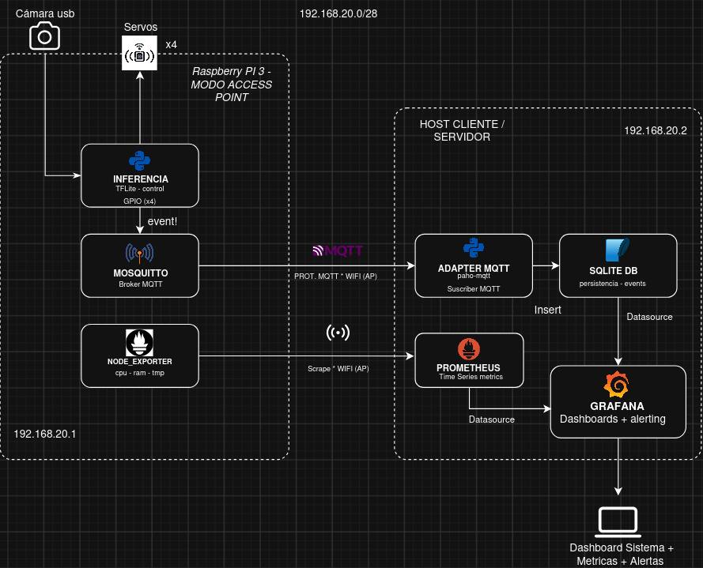

# 2026-g5-ecosort — EcoSort

**Taller de Proyecto II 2026 — Grupo G5**

Clasificador automático de residuos en 4 categorías (plástico, papel, vidrio,
orgánico) basado en visión por computadora sobre Raspberry Pi 3, con un
mecanismo físico de 4 compuertas y un pipeline de datos hacia un dashboard de
monitoreo.

> **Estado del repositorio:** fin de Semana 1 — etapa de diseño.
> Todavía no hay código de producto; lo versionado hasta ahora es
> documentación de arquitectura, decisiones (ADRs) y la bitácora del equipo.

---

## Equipo

| Integrante | usuario |
|---|---|
| Francisco Estrada | `festradax07` |
| Micaela Taini | `mikitalinda` |
| David Alvarez | `davidalvarezok` |

Docente/cátedra: seguimiento de decisiones (ver ADRs con estado *Pendiente
confirmar con el docente*).

---

## Visión general del sistema




### Componentes

- **Producto (dispositivo):** gabinete con cámara, tolva, plataforma fija de
  **4 compuertas** (una por clase, cada una con su servo SG90, las 4 arrancan
  cerradas) y la Raspberry Pi 3 en el interior.
- **Inferencia:** modelo de clasificación de 4 clases exportado a **TFLite
  int8**, obtenido por *fine-tuning* sobre un modelo preentrenado con una
  herramienta drag-and-drop (a confirmar con el docente).
- **Transporte:** **MQTT** con **Mosquitto** como broker corriendo en la
  propia Pi.
- **Persistencia:** **SQLite** (`eventos.db`), poblada por un script
  adaptador (Python + `paho-mqtt`) suscripto al tópico de eventos.
- **Visualización:** **Grafana** leyendo SQLite vía
  `grafana-sqlite-datasource`, con dashboards versionados como código.
- **Observabilidad del dispositivo (EXTRA, opcional, fase final):**
  `node_exporter` en la Pi + **Prometheus** en el host externo, como segundo
  datasource de Grafana, con reglas de alerting (staleness de `eventos`,
  `up == 0`, temperatura ~80 °C, CPU sostenida alta).

### Red

La Pi arma su propia red en modo Access Point: `192.168.20.0/28` (14 hosts
usables), Pi en `.1`, host cliente/servidor en `.2`. El tráfico MQTT nunca
sale de esta red, por lo que se acepta operar **sin TLS ni autenticación**.

---

## Estructura del repositorio

```
.
├── README.md
├── BITACORA.md                 # Bitácora semanal del equipo
└── docs/
    ├── arquitectura-software.png                     # Diagrama de arquitectura de software
    ├── adr/                     # Architecture Decision Records
    │   ├── 0001-modelo-preentrenado-vs-finetune.md
    │   ├── 0002-plataforma-4-compuertas-collar.md
    │   ├── 0003-mqtt-sqlite-como-contrato.md
    │   └── 0004-grafana-vs-dashboard-propio.md
    └── modelo-ideas/
        └── prototipo-vista-general-1.png             # Bocetos del gabinete
```

Referenciados en la documentación pero **aún no versionados**:
`docs/plan-de-proyecto.pdf`, `schema/eventos.sql`, `grafana/provisioning/`,
`grafana/dashboards/`, `docs/validacion.md`.

---

## Decisiones de arquitectura (ADRs)

| # | Decisión | Estado |
|---|---|---|
| [0001](docs/adr/0001-modelo-preentrenado-vs-finetune.md) | Fine-tuning sobre modelo preentrenado (export TFLite int8) en vez de entrenar desde cero | Propuesto — falta confirmar herramienta exacta |
| [0002](docs/adr/0002-plataforma-4-compuertas-collar.md) | Plataforma fija de 4 compuertas (una por clase), reemplaza 3 iteraciones previas | Aceptado |
| [0003](docs/adr/0003-mqtt-sqlite-como-contrato.md) | Transporte MQTT + Mosquitto; persistencia SQLite vía adaptador propio | Aceptado |
| [0004](docs/adr/0004-grafana-vs-dashboard-propio.md) | Grafana (+ Prometheus/node_exporter opcional) en vez de dashboard Flask propio | Pendiente confirmar con el docente |

---

## Avances a la fecha (Semana 1)

- [x] Repositorio creado y accesos del equipo verificados (commits de prueba de los 3 integrantes).
- [x] Modelo físico del producto definido y cerrado con el docente: plataforma de 4 compuertas con 4 servos SG90.
- [x] Pipeline de datos definido de punta a punta (Pi → MQTT → adaptador → SQLite → Grafana).
- [x] Diagrama de arquitectura de software dibujado, con direccionamiento IP real de la red AP.
- [x] 4 ADRs redactadas y versionadas.
- [x] Bocetos del gabinete (vista isométrica con cámara, tolva, plataforma y Pi interior).

## Pendiente para Semana 2

- [ ] Definir el circuito de alimentación de los componentes de hardware.
- [ ] Pruebas locales de los modelos candidatos dentro del repositorio.
- [ ] Definir en `docs/plan-de-proyecto.pdf` los modelos/MVP para cada instancia de entrega.
- [ ] Evaluar datasets: TACO, TrashNet, fotos propias o combinación.

Cronograma general: dos tramos de entrega (octubre / noviembre). ML es la ruta
crítica; la observabilidad del dispositivo se aborda recién cerca de la
entrega final.

---

## Bitácora

El seguimiento semanal del proyecto se lleva en [`BITACORA.md`](BITACORA.md).
