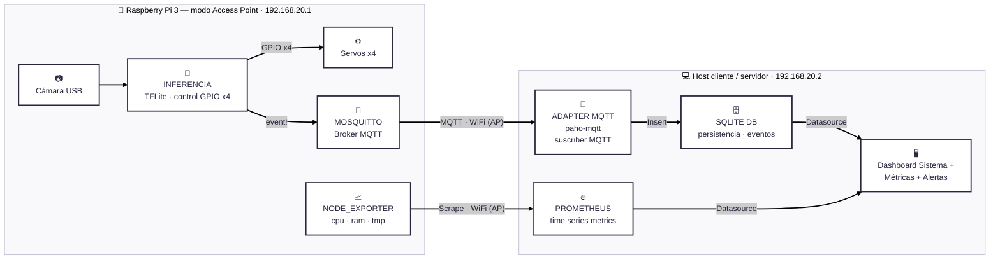

# 2026-g5-ecosort — EcoSort


**Taller de Proyecto II 2026 — Grupo G5**

Clasificador automático de residuos en 4 categorías (plástico, papel, vidrio,
orgánico) basado en visión por computadora sobre Raspberry Pi 3, con un
mecanismo físico de 4 compuertas y un pipeline de datos hacia un dashboard de
monitoreo.

> **Estado del repositorio:** fin de Semana 3 — pipeline funcionando de
> punta a punta: modelo (`vision/`, MobileNetV2 desplegado) → Raspberry Pi
> (`raspberry/`, captura + inferencia + MQTT) → host cliente/servidor
> (`host/`, adapter + dashboard, procesos separados). Roles del equipo
> repartidos por área (ver tabla de Equipo).

---

## Equipo

| Integrante | usuario | área |
|---|---|---|
| Francisco Estrada | `festradax07` | Backend y comunicación (MQTT, adaptador, schema, CI) |
| Micaela Taini | `mikitalinda` | Modelo (`vision/`, datos, entrenamiento) |
| David Alvarez | `davidalvarezok` | Firmware (servos/GPIO) y frontend del dashboard |

Docente/cátedra: seguimiento de decisiones (ver ADRs con estado *Pendiente
confirmar con el docente*).

---

## Visión general del sistema




Versión renderizada: [`docs/arquitectura-mmd.png`](docs/arquitectura-mmd.png).
El diagrama original en drawio queda como referencia histórica en
[`docs/diagramas/`](docs/diagramas/).

### Componentes

- **Producto (dispositivo):** gabinete con cámara, tolva, plataforma fija de
  **4 compuertas** (una por clase, cada una con su servo SG90, las 4 arrancan
  cerradas) y la Raspberry Pi 3 en el interior.
- **Inferencia:** modelo de clasificación de 4 clases exportado a **TFLite
  int8**, obtenido por *fine-tuning* sobre un modelo preentrenado con una
  herramienta drag-and-drop (a confirmar con el docente).
- **Transporte:** **MQTT** con **Mosquitto** como broker corriendo en la
  propia Pi.
- **Persistencia:** **SQLite** (`eventos.db`), poblada por un script
  adaptador (Python + `paho-mqtt`) suscripto al tópico de eventos.
- **Visualización:** **dashboard propio (Front End)**, leyendo el dato de
  negocio desde SQLite y, como segundo datasource, Prometheus para la salud
  del dispositivo — reemplaza a Grafana a pedido del docente (ver
  [ADR 0005](docs/adr/0005-dashboard-propio-reemplaza-grafana.md)).
- **Observabilidad del dispositivo (EXTRA, opcional, fase final):**
  `node_exporter` en la Pi + **Prometheus** en el host externo, como
  datasource del dashboard propio, con reglas de alerting a reimplementar
  (staleness de `eventos`, `up == 0`, temperatura ~80 °C, CPU sostenida alta).

### Red

La Pi arma su propia red en modo Access Point: `192.168.20.0/28` (14 hosts
usables), Pi en `.1`, host cliente/servidor en `.2`. El tráfico MQTT nunca
sale de esta red, por lo que se acepta operar **sin TLS ni autenticación**.

---

## Modelo — [`vision/`](vision/)

Transfer learning (ADR 0001) sobre el dataset público
[TrashNet](https://github.com/garythung/trashnet) (`vision/data/trashnet/`,
6 clases: cardboard, glass, metal, paper, plastic, trash — todavía sin
mapear a las 4 clases finales del producto, ver `vision/classes.py`).
Backbone por defecto: **MobileNetV2 224px**, el mismo que está desplegado
en `raspberry/modelo/`; `mobilenetv3small` queda como alternativa para
comparar en igualdad de condiciones. Se entrena en Colab
([`vision/notebooks/entrenar_colab.ipynb`](vision/notebooks/entrenar_colab.ipynb))
o local/Docker — ver [`vision/README.md`](vision/README.md).

## Raspberry Pi — [`raspberry/`](raspberry/)

Lo que corre **en la Pi**: captura por cámara USB, inferencia TFLite,
conteo de objetos por diferencia de fondo y publicación MQTT (Mosquitto).
Ya no incluye el dashboard — ver la sección siguiente. Guía completa de
puesta en marcha:
[`docs/guia-instalacion-raspberry.md`](docs/guia-instalacion-raspberry.md).

## Host cliente/servidor — [`host/`](host/)

Lo que corre **fuera de la Pi**, en la misma LAN: el adapter (MQTT → SQLite,
único INSERT real, ADR 0003) y el dashboard (backend + frontend, lee esa
misma base). Dos procesos independientes, no un monolito — ver
[`host/README.md`](host/README.md) para el porqué y cómo correrlos.

---

## Documentos y entregas

| Documento | Contenido |
|---|---|
| [`docs/Plan de Proyecto-G5.pdf`](<docs/Plan de Proyecto-G5.pdf>) | Plan de Proyecto entregado (requerimientos, objetivos, alcance) |
| [`docs/presentaciones/EcoSort_Presentacion.pdf`](docs/presentaciones/EcoSort_Presentacion.pdf) | PowerPoint de la presentación del proyecto |
| [`docs/circuito-de-alimentacion/Circuito de alimentación.pdf`](<docs/circuito-de-alimentacion/Circuito de alimentación.pdf>) | Circuito de alimentación de Raspberry Pi, servos y demás componentes |
| [`docs/modelo-ideas/varios-prototipos-propuestos.pdf`](docs/modelo-ideas/varios-prototipos-propuestos.pdf) | Prototipos de maqueta evaluados para el gabinete |

---

## Estructura del repositorio

```
.
├── README.md
├── BITACORA.md                              # Bitácora semanal del equipo
├── docs/
│   ├── Plan de Proyecto-G5.pdf              # Entrega del Plan de Proyecto
│   ├── arquitectura-mmd.png                 # Render del diagrama Mermaid
│   ├── arquitectura-software.png            # Diagrama de arquitectura (versión anterior)
│   ├── adr/                                 # Architecture Decision Records
│   │   ├── 0001-modelo-preentrenado-vs-finetune.md
│   │   ├── 0002-plataforma-4-compuertas-collar.md
│   │   ├── 0003-mqtt-sqlite-como-contrato.md
│   │   ├── 0004-grafana-vs-dashboard-propio.md
│   │   ├── 0005-dashboard-propio-reemplaza-grafana.md
│   │   ├── 0006-systemd-vs-docker-en-la-pi.md
│   │   ├── 0007-docker-compose-en-el-host.md
│   │   ├── 0008-contrato-de-eventos.md
│   │   └── 0009-deteccion-en-cascada-y-rechazo.md
│   ├── circuito-de-alimentacion/
│   │   └── Circuito de alimentación.pdf
│   ├── diagramas/
│   │   ├── arquitectura.mmd                 # Fuente Mermaid (canónica)
│   │   └── TDP2 - ECOSORT-SYSTEM-DIAGRAM(4).drawio   # Fuente drawio (histórica)
│   ├── modelo-ideas/
│   │   ├── prototipo-vista-general-1.png
│   │   └── varios-prototipos-propuestos.pdf
│   └── presentaciones/
│       └── EcoSort_Presentacion.pdf
├── vision/                                   # entrenamiento del modelo (ver vision/README.md)
│   ├── data/trashnet/                       # dataset TrashNet versionado
│   ├── notebooks/entrenar_colab.ipynb       # entrena en Colab, llama a estos scripts
│   ├── models.py, train.py, evaluate.py, export_tflite.py, webcam_test.py
│   └── Dockerfile, docker-compose.yml       # entrenar/evaluar/exportar reproducible
├── raspberry/                                # corre EN la Pi
│   ├── modelo/                              # ecosort_int8.tflite, ecosort_fp32.tflite, labels.txt
│   ├── ecosort_pi.py, inferencia_pi.py, ecosort_mqtt.py, vista_en_vivo.py
│   ├── deteccion.py, clases.py             # cuándo y si analizar (ADR 0009); vocabulario de clases
│   ├── tests/test_deteccion.py
│   └── mosquitto/ecosort.conf
├── host/                                     # corre en el host cliente/servidor, no en la Pi
│   ├── docker-compose.yml                   # adapter + dashboard (+ docker-compose.dev.yml: broker local)
│   ├── adapter/adapter.py                   # MQTT -> SQLite, único INSERT real
│   └── dashboard/
│       ├── backend/backend.py               # lee SQLite, sirve la API + el panel
│       └── frontend/index.html
└── schema/                                   # el contrato de eventos (docs/contrato-mqtt.md)
    ├── evento.schema.json, clases.json, eventos.sql
    └── tests/test_contrato.py
```

Referenciado en la documentación pero **aún no versionado**: `docs/validacion.md`
(la metodología de validación del modelo, entregable de noviembre). El dashboard propio ya existe,
sin framework todavía (ver [ADR 0005](docs/adr/0005-dashboard-propio-reemplaza-grafana.md)).

---

## Decisiones de arquitectura (ADRs)

| # | Decisión | Estado |
|---|---|---|
| [0001](docs/adr/0001-modelo-preentrenado-vs-finetune.md) | Fine-tuning sobre modelo preentrenado (export TFLite int8) en vez de entrenar desde cero | Propuesto — falta confirmar herramienta exacta |
| [0002](docs/adr/0002-plataforma-4-compuertas-collar.md) | Plataforma fija de 4 compuertas (una por clase), reemplaza 3 iteraciones previas | Aceptado |
| [0003](docs/adr/0003-mqtt-sqlite-como-contrato.md) | Transporte MQTT + Mosquitto; persistencia SQLite vía adaptador propio | Aceptado |
| [0004](docs/adr/0004-grafana-vs-dashboard-propio.md) | Grafana (+ Prometheus/node_exporter opcional) en vez de dashboard propio | Rechazada — reemplazada por ADR 0005 |
| [0005](docs/adr/0005-dashboard-propio-reemplaza-grafana.md) | Dashboard propio (Front End) leyendo SQLite + Prometheus, en vez de Grafana — a pedido del docente | Aceptado |
| [0006](docs/adr/0006-systemd-vs-docker-en-la-pi.md) | Servicios en la Pi (Mosquitto, inferencia, node_exporter) corren con systemd, no Docker | Aceptado |
| [0007](docs/adr/0007-docker-compose-en-el-host.md) | Servicios del host (adapter, dashboard, luego Prometheus) se despliegan con Docker Compose | Aceptado |
| [0008](docs/adr/0008-contrato-de-eventos.md) | Contrato de eventos v1: 5 clases de producto y 5 compuertas (metal incluido; LEDs en octubre), validación en el adapter | Aceptado (26/9) |
| [0009](docs/adr/0009-deteccion-en-cascada-y-rechazo.md) | Detección en cascada (quietud, tamaño, modelo) y clase `ninguno` para rechazar lo que no es un residuo (manos, caras, animales) | Aceptado (26/9) |

---

## Avances (Semana 3)

- [x] Mergeado el runtime completo de la Raspberry Pi (rama `Mica`, integración de prueba): captura por cámara, inferencia TFLite, conteo de residuos, MQTT y dashboard — funcionando de punta a punta contra la Pi real.
- [x] Modelo entrenado y desplegado (MobileNetV2, TFLite int8): 31ms de latencia en la Pi, ~79% de accuracy en test (dataset TrashNet, todavía sin la clase orgánico).
- [x] Unificados los dos pipelines de entrenamiento en `vision/`, con MobileNetV2 como backbone por defecto y MobileNetV3Small como alternativa a comparar.
- [x] Separado el dashboard en procesos independientes (`host/adapter/` + `host/dashboard/`), sacándolo de la Pi — la integración anterior corría todo por `localhost`, sin que MQTT cruzara red de verdad. ADR 0006 (systemd en la Pi) y ADR 0007 (Docker Compose en el host) documentadas, y `host/` ya se levanta con `docker compose up`.
- [x] Contrato de eventos v1 definido y verificado ([`docs/contrato-mqtt.md`](docs/contrato-mqtt.md), ADR 0008): 5 clases y 5 compuertas (el metal se suma; en octubre las salidas se simulan con LEDs), JSON Schema versionado, validación en el adapter con registro de rechazos y tests de contrato en CI.
- [x] Detección robusta (ADR 0009): una máquina de estados exige que el objeto quede quieto y tenga tamaño de residuo antes de analizarlo, y la nueva clase `ninguno` permite rechazar lo que no es un residuo sin ensuciar los eventos. En una comparación sintética pasó de 4 eventos falsos sobre 6 a 0, y de 285 a 15 inferencias. Umbrales todavía sin calibrar con la cámara real.
- [x] Repartidos los roles del equipo para lo que sigue (ver tabla de arriba).

## Pendiente para Semana 4

- [ ] Review de los 3 del contrato v1 y de la detección (ADR 0008 y 0009) antes de mergearlos.
- [ ] Fotos propias del gabinete (con orgánico, latas/aluminio para metal, y **negativos para la clase `ninguno`**: manos, caras, animales, plataforma vacía) para reentrenar — la mejora de precisión más importante pendiente.
- [ ] Calibrar los umbrales de la detección con la cámara real y hacer la sesión de "el gracioso" (10 minutos intentando engañarlo) midiendo eventos falsos.
- [ ] Firmware: 5 salidas por GPIO configurables — LEDs en octubre, servos en noviembre (bloqueado por hardware, llega en unas semanas) — y enganchar las señales de la detección a LEDs y sonidos que le den expresión a la papelera (objeto no reconocido, cayó, se trabó).
- [ ] Sumar a la lista de materiales el sensor de distancia (ToF), un buzzer o parlante pequeño y LEDs de estado.
- [ ] Quinta compuerta (metal): reservar el hueco en la maqueta y comprar el quinto SG90 con el resto del pedido; avisar a la cátedra (el Plan entregado dice 4).
- [ ] Unit files de `systemd` para `ecosort_pi.py` en la Pi (ADR 0006).

Detalle completo semana a semana en [`BITACORA.md`](BITACORA.md).

Cronograma general: dos tramos de entrega (octubre / noviembre). ML es la ruta
crítica; la observabilidad del dispositivo se aborda recién cerca de la
entrega final.

---

## Bitácora

El seguimiento semanal del proyecto se lleva en [`BITACORA.md`](BITACORA.md).
